# Phase 5 — Deploy + Pitch (refined)

**Status:** 🟢 Ready
**Spec:** Section 9 of `AGENTS.md` + section 11a/11b/11c
**Owner:** OpenCode (`@ZAI Coder`) for deploy scripts, Filip for pitch + slides
**Working directory:** `C:\WorkArea\AI\scarp\`

---

## 1. Goal

Two things:
1. **Live deploy** — frontend on Azure Static Web Apps, backend on Azure App Service or Container Apps, both reachable from a public URL
2. **Pitch artifacts** — README, 60-sec script, 2 slides, demo GIF

The AI judge can't see a laptop. The frontend must be reachable at a URL that the judge can open.

## 2. Architecture decision — recommended

**Frontend:** Azure Static Web Apps (free tier)
- Auto-deploys from GitHub via Actions
- Custom domain optional (use `*.azurestaticapps.net` for hackathon)
- CDN included
- Can call backend API from the same domain (built-in proxy)

**Backend:** Azure App Service Linux Python 3.12 (B1 SKU, ~€13/month)
- Slim FastAPI runtime works out-of-the-box on App Service (no container needed)
- `LLM_API_KEY` as App Service config (provider-agnostic — works with Anthropic, OpenAI, DeepInfra)
- HTTPS endpoint automatic
- Default: **GLM 4.7 Flash via DeepInfra** (open-weight, ~7x cheaper than Claude Sonnet, provider-swappable)

**Why this combo:**
- No Docker complexity
- Free frontend tier
- Backend B1 is €13/month — cancelable after the demo
- Standard Azure patterns Filip uses at Delaware (legitimate "I deployed this professionally" pitch angle)

**Alternative (cheaper but more setup):**
- Frontend on Cloudflare Pages (free)
- Backend on Azure Functions Python (consumption tier, scales to zero)
- More config, but ~€0 monthly cost

## 3. Deploy steps

### 3.1 Frontend → Azure Static Web Apps

```powershell
cd C:\WorkArea\AI\scarp\frontend
pnpm build
```

Then via Azure Portal OR CLI:

```powershell
az login
az staticwebapp create `
  --name scarp-frontend `
  --resource-group scarp-rg `
  --source https://github.com/flupkede/scarp `
  --location westeurope `
  --branch main `
  --app-location "/frontend" `
  --output-location "build" `
  --login-with-github
```

Static Web Apps will create a GitHub Action automatically.

In `frontend/.env.production`:
```
PUBLIC_API_URL=https://scarp-api.azurewebsites.net
```

### 3.2 Backend → Azure App Service

```powershell
cd C:\WorkArea\AI\scarp\backend
```

Create `backend/startup.sh`:
```bash
#!/bin/bash
uvicorn scarp.api.main:app --host 0.0.0.0 --port 8000
```

Deploy:
```powershell
az webapp up `
  --name scarp-api `
  --resource-group scarp-rg `
  --runtime "PYTHON:3.12" `
  --sku B1 `
  --location westeurope
```

Then set environment variables:
```powershell
az webapp config appsettings set `
  --name scarp-api `
  --resource-group scarp-rg `
  --settings LLM_API_KEY="$env:LLM_API_KEY" `
             CORS_ALLOW_ORIGINS="https://scarp-frontend.azurestaticapps.net"
```

Set startup command:
```powershell
az webapp config set `
  --name scarp-api `
  --resource-group scarp-rg `
  --startup-file "uvicorn scarp.api.main:app --host 0.0.0.0 --port 8000"
```

### 3.3 Verify

```powershell
curl https://scarp-api.azurewebsites.net/health
curl https://scarp-api.azurewebsites.net/api/zones?limit=5
```

Open the Static Web App URL — splash should show, then map with zones.

## 4. Security checklist

The North Star AI judge values security posture. Demonstrate it:

- [ ] No secrets in repo (verify with `git log --all -p | grep -i "api_key\|sk-\|key-"`)
- [ ] `.env` and `.env.local` gitignored
- [ ] CORS allowlist (NOT `*`) — only the Static Web App origin
- [ ] HTTPS-only on App Service (default)
- [ ] LLM API key in App Service config, never client-side
- [ ] `SECURITY.md` in repo describing the threat model
- [ ] Dependabot enabled (GitHub repo settings)
- [ ] Rate limit on `/api/search` endpoint
- [ ] No `eval()`, no dynamic imports of user input
- [ ] Input validation via Pydantic on all endpoints
- [ ] CSP header set
- [ ] Security headers (X-Frame-Options, X-Content-Type-Options, Referrer-Policy)

Add `SECURITY.md`:

```markdown
# Security posture

## Secrets
- `LLM_API_KEY` is stored as Azure App Service configuration only
- Provider-agnostic: works with Anthropic, OpenAI, DeepInfra, or any OpenAI-compatible API
- Never exposed to the client
- No keys in source code, no keys in CI logs

## Network
- Backend: HTTPS only, CORS restricted to known frontend origin
- Frontend: served via Azure CDN with auto HTTPS

## Input handling
- All endpoints use Pydantic models for input validation
- /api/search query truncated to 500 chars to prevent prompt-injection attacks
- Rate limited to 10 requests/min per IP

## Dependencies
- `pip-audit` and `pnpm audit` run in CI
- Dependabot enabled
- Pinned major versions

## What this app does NOT do
- No PII collection
- No persistent state per user
- No third-party tracking
- No data sold or shared
```

## 5. README — final form

**Hero section** at top:

```markdown
<h1 align="center">SCARP</h1>
<p align="center"><i>Mapping where the next landslide could strike — and where we're too blind to know.</i></p>

[Demo screenshot with map showing target symbols + grey hatch overlay]

A prioritization tool for landslide monitoring placement in Alaska.
Combines geology, infrastructure, and monitoring coverage to rank sensor locations.
Shows both where to act AND where public data is insufficient.

[Live demo](https://scarp-frontend.azurestaticapps.net) ·
[Story](https://www.nationalgeographic.com/...) ·
[Methodology](#methodology)
```

**Sections:**
1. The problem (Hig + mason jars, 2 paragraphs)
2. Two findings (sensor placement + data gaps — the honest story)
3. The approach (data sources + scoring, 2 paragraphs)
4. Architecture diagram (Mermaid)
5. Live demo + screenshots
6. Run locally
7. Data sources (table with links + licenses)
8. Data confidence methodology (how we measure blind spots)
9. Security posture (link to SECURITY.md)
10. Credits
11. License (MIT)

**Architecture diagram (Mermaid):**

```mermaid
flowchart LR
    subgraph Data["Data Sources"]
        D1[USGS n10 Susceptibility]
        D2[USGS 3DEP DEM]
        D3[DGGS Inventory]
        D4[OSM Alaska]
        D5[AEC Stations]
        D6[USFS Tongass]
    end
    subgraph Pipeline["Spatial Pipeline (Python, 90m grid)"]
        P1[Normalize CRS → 3338]
        P2[Slope + Relief from DEM]
        P3[Exposure from OSM]
        P4[Monitoring mask]
        P5[Confidence raster]
        P6[Score + regional fairness]
    end
    subgraph Runtime["Runtime (Azure)"]
        R1[FastAPI Backend]
        R2[Svelte 5 Frontend]
        R3[LLM API]
    end
    Data --> Pipeline
    Pipeline --> R1
    R1 --> R2
    R1 --> R3
    R3 --> R1
```



## 6. Pitch script — `docs/pitch.md`

**60 seconds, structured to leave two memorable moments.**

```
[0-10s] HOOK
"In 1958, the world's tallest wave hit Lituya Bay, Alaska — 524 meters.
 People assumed it was a once-in-a-millennium event.
 Last August, Tracy Arm came within 50 meters of that record. No one saw it coming."

[10-25s] PROBLEM
"There's one man trying to find the next one before it happens.
 Bretwood Higman builds sensors in mason jars — $300 each — and installs them by hand.
 He's one guy with limited time and infinite coastline.
 He doesn't know where to put the next one."

[25-45s] DEMO (live, switch to screen)
"So I built Scarp." [show splash, fade to map]
"It combines Alaska's geology, infrastructure, and current monitoring coverage
 to rank the places where Hig's next sensor would matter most." [click top site]
"Each target is a recommended placement, with a full breakdown of why." [show detail panel]
"But here's the honest part." [toggle confidence layer ON]
"The grey areas? That's where public data is too thin to assess.
 Including Lituya Bay — site of the tallest wave ever recorded.
 That grey isn't safety. It's the gap in public data."

[45-60s] CLOSE
"Scarp shows both where to act and where we're flying blind.
 Two findings from one tool: priority sites AND data gaps.
 I'm sending this to Hig after the event.
 If it helps him place even one sensor in the right place, it was worth the day."
```

**Pitch notes:**
- The data-lag moment ("the grey isn't safety") is the second memorable line after "Nobody saw it coming"
- Toggle the confidence layer LIVE during the demo — it's visual and defensible
- If Tracy Arm ranks low (it does — data gap), explain it: "Tracy Arm ranks 61st not because it's safe, but because the 2025 event isn't in any inventory yet. The grey shows you why."
- Read aloud, time it. Cut 5 seconds if over 60.

## 7. Slides — `docs/slides.md`

Two slides only. Built with Marp or just plain markdown for screen-share.

**Slide 1:** Title + photo
- Background: USGS Tracy Arm aerial photo (Cyrus Read/USGS, 13 Aug 2025 — US govt work, free to use)
  Source: https://science.nasa.gov/earth/earth-observatory/tracy-arms-post-tsunami-landscape/
  Alt source (more photos): https://www.usgs.gov/programs/landslide-hazards/science/2025-tracy-arm-landslide-generated-tsunami
- Title: "SCARP"
- Subtitle: "Where to place the next sensor — and where we're too blind to know."
- Footer: name + GitHub link

**Slide 2:** Methodology + findings
- Left: data sources table (USGS n10, DEM, OSM, DGGS inventory)
- Center: scoring formula (weighted-additive, 6 components) + confidence definition
- Right: two findings — "priority sites" (targets) + "data gaps" (grey)
- Tech stack one-liner: "FastAPI + Svelte 5 + GLM 4.7 Flash + Azure"

## 8. Demo GIF

Use OBS Studio or ScreenToGif on Windows:
1. Record 15 seconds:
   - Splash appears, fades
   - Map loads with target symbols and influence circles
   - Click on top site, detail panel slides in with component breakdown
   - Toggle confidence layer ON to show grey hatch
2. Compress with gifski or save as MP4 + convert
3. Target size <5MB for README

## 9. Rehearsal

Practice the 60-second pitch 3 times solo. Time it. Adjust.

Common mistakes to avoid:
- Talking too long about the problem (cut to demo by second 25)
- Showing too many features (show ONE click + ONE search, that's it)
- Forgetting to land "Nobody saw it coming" with weight
- Rushing the close — pause before "If it helps him place even one sensor..."

## 10. Definition of Done

- [ ] Live frontend URL works
- [ ] Live backend `/health` returns 200
- [ ] Map loads zones from live API (verify in browser devtools)
- [ ] Search endpoint works against live Anthropic API
- [ ] README has hero screenshot + GIF + run instructions + credits
- [ ] SECURITY.md exists in repo root
- [ ] Pitch script in docs/pitch.md, timed to 60s
- [ ] Two slides exportable as PNG or PDF
- [ ] All copyrighted media removed; only USGS / our own assets

## 11. Time estimate

| Step | Estimate |
|---|---|
| Azure resource group + SWA + App Service creation | 30 min (first time) |
| Backend deploy + env vars | 20 min |
| Frontend deploy + verify | 15 min |
| SECURITY.md + README polish | 30 min |
| Demo GIF recording + compression | 20 min |
| Pitch script + slides | 30 min |
| Rehearsal | 15 min |
| **Total** | **~2.5 hours** |

## 12. Risks

| Risk | Mitigation |
|---|---|
| Azure quota issues on hackathon Wi-Fi | Have backup: deploy from home Friday evening, just verify on the day |
| Backend cold-start slow on B1 | Hit `/health` 1 min before pitch starts to warm up |
| LLM API down during pitch | Pre-cache the search result for "near cruise ship routes" query as static fallback |
| Slow Wi-Fi at venue | Have demo recorded as MP4 as backup; play that if live demo fails |
| Forgot to set LLM_API_KEY in App Service | Smoke-test search endpoint immediately after deploy |
| Custom domain DNS not propagated | Skip custom domain, use `*.azurestaticapps.net` URL |
| Judge asks "why isn't Lituya Bay in your top 10?" | Confidence layer answer: "It's in a data-limited zone — low score means unknown, not safe" |

## 13. Cancellation plan after event

If you don't want to keep paying B1 (~€13/month):
- `az group delete --name scarp-rg --yes` — kills everything in the resource group
- Repo stays public on GitHub as portfolio

Or migrate to free tier:
- Frontend stays on Static Web Apps free tier (always free)
- Backend → Azure Container Apps consumption tier (scales to zero, ~€0/month for low traffic)

## 14. After the event

If you actually want to send this to Hig:

- Email: contact form at https://groundtruthalaska.org (verify before sending)
- Subject: "A monitoring placement tool inspired by your work"
- Body: 3 sentences max, link to live demo, link to GitHub, offer to extend it for his use
- Don't oversell — let the tool speak for itself

This is the most important outcome of the project, regardless of hackathon results.
